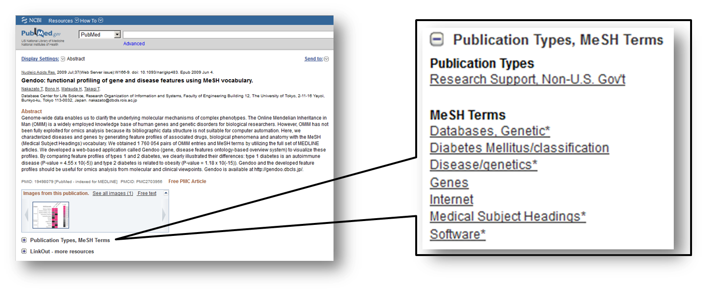

# What is MeSH?

MeSH (Medical Subject Headings) is the NLM (U. S. National Library of Medicine) controlled vocabulary used to manually index articles for MEDLINE/PubMed^[S. J. Nelson and et al. The MeSH translation maintenance system: structure, interface design, and implementation. Stud. Health Technol. Inform., 107: 67-69, 2004.] and is a collection of a comprehensive life science vocabulary.



# What is MeSH ORA Framework?

MeSH contains more than 25,000 clinical and biological terms. The amount of MeSH term is about twice as large as that of GO (Gene Ontology)^[M. Ashburner and et al. Gene ontology: tool for the unification of biology. The Gene Ontology Consortium. Nat. Genet., 25(1): 25-29, 2000.] and its categories are also wider. Therefore MeSH is expected to be a much detailed and exhaustive gene annotation tool. In particular, MeSH can be an excellent source of information for minor species with small research populations and many genes that have not yet been functionally annotated.

Since BioC 2.14 (Apr. 2014), we have been distributing the information about MeSH itself (`MeSH.db`/`MeSH.AOR.db`/`MeSH.PCR.db`) and the correspondence between MeSH and genes of more than 100 species (`MeSH.XXX.eg.db`-type package) as annotation packages. We have also distributed a software package (`r Biocpkg("MeSHDbi")`) to define classes for the above annotation packages and to help users create their annotation packages, and a software package (`r Biocpkg("meshr")`) to perform enrichment analysis using the `MeSH.XXX.eg.db`-type package. Here, we call these MeSH-related packages MeSH ORA framework. Please refer to the previous vignette^[https://bioconductor.org/packages/3.13/bioc/vignettes/meshr/inst/doc/MeSH.pdf] for the description of creating individual data packages.

# Specification change of MeSH ORA Framework from BioC 3.14 (Nov. 2021)

The specifications of the MeSH ORA framework have changed significantly since BioC 3.14. Specifically, the distribution of all annotation packages will be abolished, and the policy has been switched to one where the data is placed on a cloud server called AnnotationHub, and users are allowed to retrieve the data only when they really need it. Note that this change will also change the specifications of all software packages that used the previous MeSH annotation packages, so backward compatibility will no longer be maintained.

The following are the advantages of this AnnotationHub-style.

- The installation time of the entire Bioconductor packages will be reduced.
- Old data will be archived.
- Data reproducibility is ensured (e.g. the version of the data can be specified, such as "v001").

In the following sections, we will show you how to use the new AnnotationHub-style MeSH ORA framework. If you want to check the previous style of the MeSH ORA framework for some reason, please check the vignette of meshr in BioC 3.13^[https://bioconductor.org/packages/3.13/bioc/vignettes/meshr/inst/doc/MeSH.pdf].

# Access to MeSH data on AnnotationHub

To access the MeSH datasets on AnnotationHub, we firstly install and load the `r Biocpkg("AnnotationHub")` package.

```{r Access1, eval=FALSE}
library("AnnotationHub")
```

`AnnotationHub()` returns the metadata of all the data stored in the AnnotationHub server.

```{r Access2, eval=FALSE}
ah <- AnnotationHub()
```

`mcol()` reshapes the result of `ah` as follows.

```{r Access3, eval=FALSE}
head(mcols(ah))
```

`query()` returns the details of a specific entry of AnnotationHub. Note that this just returns the metadata and not actual data.

```{r Access4, eval=FALSE}
mcols(query(ah, c("MeSHDb", "MeSH.db", "v001")))
```

By specifying some keywords and adding [[1]] with the `query()`, `query()` downloads the data to our local machine. The internal data (SQLite files) of the previous MeSH annotation packages will be stored as a cache on our local machines by the `r Biocpkg("BiocFileCache")` mechanism.

```{r Access5, eval=FALSE}
dbfile1 <- query(ah, c("MeSHDb", "MeSH.db", "v001"))[[1]]
dbfile2 <- query(ah, c("MeSHDb", "MeSH.AOR.db", "v001"))[[1]]
dbfile3 <- query(ah, c("MeSHDb", "MeSH.PCR.db", "v001"))[[1]]
dbfile4 <- query(ah, c("MeSHDb", "Danio rerio", "v001"))[[1]]
dbfile5 <- query(ah, c("MeSHDb", "Pseudomonas aeruginosa PAO1", "v001"))[[1]]
```

These SQLite files can be immediately converted into `MeSHDb` objects by running `MeSHDbi::MeSHDb` and can be used for the MeSH enrichment analysis described in the next section.

```{r Access6, eval=FALSE}
library("MeSHDbi")
MeSH.db <- MeSHDbi::MeSHDb(dbfile1)
MeSH.AOR.db <- MeSHDbi::MeSHDb(dbfile2)
MeSH.PCR.db <- MeSHDbi::MeSHDb(dbfile3)
MeSH.Dre.eg.db <- MeSHDbi::MeSHDb(dbfile4)
MeSH.Pae.PAO1.eg.db <- MeSHDbi::MeSHDb(dbfile5)
```

# MeSH Enrichment Analysis

After the conversion of `MeSHDb` objects from SQLite files as described above, MeSH enrichment analysis can be performed by the `r Biocpkg("meshr")` package in much the same way as before BioC 3.13, as follows. For the details of MeSH enrichment analysis, please check the vignette of `r Biocpkg("meshr")` in BioC 3.13^[https://bioconductor.org/packages/3.13/bioc/vignettes/meshr/inst/doc/MeSH.pdf].

```{r EA1, eval=FALSE}
library("meshr")

# dummy geneids for demo
geneid <- keys(MeSH.Pae.PAO1.eg.db, keytype="GENEID")
set.seed(1234)
sig.geneid <- sample(geneid, 500)

meshParams <- new("MeSHHyperGParams",
    geneIds = sig.geneid,
    universeGeneIds = geneid,
    annotation = "MeSH.Pae.PAO1.eg.db",
    meshdb = "MeSH.db", # Newly added parameter from BioC 3.14
    category = "A",
    database = "Escherichia coli str. K-12 substr. MG1655",
    pvalueCutoff = 0.5, pAdjust = "BH")
meshR <- meshHyperGTest(meshParams)
```

One point to note is that previously only the `MeSH.XXX.eg.db`-type object had to be prepared in advance and specified as the `annotation` argument, but now due to the `r Biocpkg("AnnotationHub")`, `MeSH.db` object must also be prepared in advance and specified as a `meshdb` argument like above.

After performing MeSH enrichment analysis, we can check the result of the test by `summary()`.

```{r EA2, eval=FALSE}
head(summary(meshR))
```

Switching to test another MeSH category and database can be easily done. For example, to choose the category as `B` (Organisms) and the database as reciprocal BLAST best hit (RBBH) with Bacillus subtilis, we can do the following.

```{r EA3, eval=FALSE}
category(meshParams) <- "B"
database(meshParams) <- "Bacillus subtilis subsp. subtilis str. 168"
meshR <- meshHyperGTest(meshParams)
head(summary(meshR))
```

# Session Information {.unnumbered}

```{r sessionInfo, echo=FALSE}
sessionInfo()
```